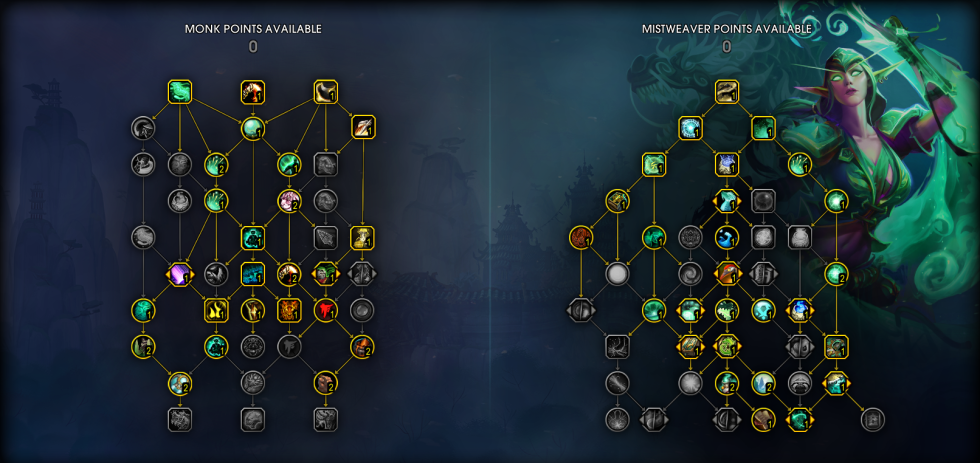
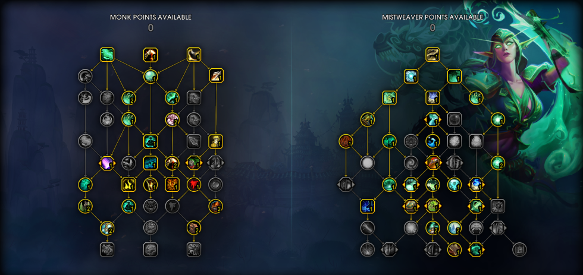
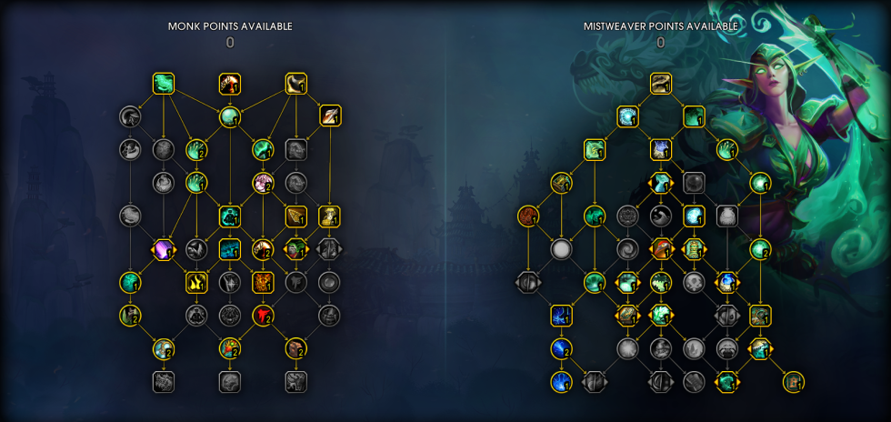

import Tabs from "@theme/Tabs";
import TabItem from "@theme/TabItem";

# Mistweaver PvE Quick Guide

_by Mimiro_

This guide is designed to a one-stop-shop to cover all bases for Mistweaver with just the information you need. For more in-depth, advanced information follow the “Advanced” section in the menu above. Navigate quickly to the section you need using the sidebar on the right.

This guide was updated for Dragonflight 10.0.7. The overhaul of the earlier mentioned advanced guides is in progress. In general this guide will be regularly updated when discussion, theorycrafting, or testing yield new information.

## Talent Builds

Mistweavers are surprisingly flexible in builds between raiding and m+.

While raiding itself usually has a default setup that leaves only little room for good alternatives, you still get to change things up for a few specific bosses like [The Primal Council](https://www.wowhead.com/guide/raids/vault-of-the-incarnates/primal-council-strategy).

In m+ you can decide between a lot of talents even in the third section of the Mistweaver tree, only [Faeline Stomp](https://www.wowhead.com/spell=388193/faeline-stomp) and the two nodes right below it are pretty much set in stone.

### General information

_Mistweaver Tree_

- [Overflowing Mists](https://www.wowhead.com/spell=388511/overflowing-mists) is VERY underwhelming unless you use [Enveloping Mist](https://www.wowhead.com/spell=124682/enveloping-mist) a LOT on your tank. It basically never triggers on any other party member, because it requires a direct physical hit. And no, [Melandrus](https://www.wowhead.com/guide/mythic-plus-dungeons/court-of-stars-strategy#overview-advisor-melandrus) Maelstrom doesn’t trigger it, unfortunately. This is the first point to use if you want to change things in the second section.
- You can always flex the point(s) I used for [Spirit of the Crane](https://www.wowhead.com/spell=210802/spirit-of-the-crane) or [Mana Tea](https://www.wowhead.com/spell=197908/mana-tea). Taking both talents for mana might seem like overkill, but on Tyrannical weeks some bosses can take a very long time.
- [Gift of the Celestials](https://www.wowhead.com/spell=388212/gift-of-the-celestials) or [Jade Bond](https://www.wowhead.com/spell=388031/jade-bond) comes down to the dungeon you’re running and your confidence how you can handle the different CD timers.
- [Zen Pulse](https://www.wowhead.com/spell=124081/zen-pulse) and its follow up talent can be easily accessed, but even if this spell provides good numbers I prefer the value other nodes give me (such as better mana economy)

  <Tabs>
    <TabItem value="Standard Raid Talents (Sheilun's Gift)">
    **Build Import:**
    ```
    B4QAAAAAAAAAAAAAAAAAAAAAA0CpgEJUaFJRE5AJNk0SRAAAAAAAAAAAAAJkUQikEJCSSSDyBEAAB
    ```
    

    **Personal Preference Changes:**
    *Class Tree*
    *   This build tries to cover as many bases as possible with the auras, a lot of defensive capabilities and single target damage through [Eye of the Tiger](https://www.wowhead.com/spell=196607/eye-of-the-tiger).
    *   If you don’t need the extra defense from [Fortifying Brew](https://www.wowhead.com/spell=115203/fortifying-brew), you can invest that point into [Improved Roll](https://www.wowhead.com/spell=328669/improved-roll) for some more mobilty or [Paralysis](https://www.wowhead.com/spell=115078/paralysis)/[Spear Hand Strike](https://www.wowhead.com/spell=116705/spear-hand-strike). You will also be able to drop [Disable](https://www.wowhead.com/spell=116095/disable). Be aware of your newly required pathing if you want to keep [Celerity](https://www.wowhead.com/spell=115173/celerity).
    *   If you want [Resonant Fists](https://www.wowhead.com/spell=389578/resonant-fists), you will have to drop 3-4 nodes, depending on whether or not you path through [Escape from Reality](https://www.wowhead.com/spell=394110/escape-from-reality). Your options would be [Bounce Back](https://www.wowhead.com/spell=389577/bounce-back), [Eye of the Tiger](https://www.wowhead.com/spell=196607/eye-of-the-tiger), [Disable](https://www.wowhead.com/spell=116095/disable)/[Fortifying Brew](https://www.wowhead.com/spell=115203/fortifying-brew) (you might need to invest 1 of those to keep [Celerity](https://www.wowhead.com/spell=115173/celerity)!)
    
    \*\*\* As of now, [Bounce Back](https://www.wowhead.com/spell=389577/bounce-back) triggers on very few abilities in raids, even on mythic difficulty. We suspect that the damage calculation for the trigger is not correct. Please check in your logs if you even get the buff during the fight you’re currently progressing on.

    *Mistweaver Tree*

    *   [Mana Tea](https://www.wowhead.com/spell=197908/mana-tea) is a completely optional node in the mid section of the tree, you can move it freely – but usually it is the best contender for this freely available point.
    *   [Jade Bond](https://www.wowhead.com/spell=388031/jade-bond) (~2:15min celestial only if you use [Chi-Ji](https://www.wowhead.com/spell=325197/invoke-chi-ji-the-red-crane)) can be changed into [Gift of the Celestials](https://www.wowhead.com/spell=388212/gift-of-the-celestials) (1min celestial) if your timers favor it. [Jade Bond](https://www.wowhead.com/spell=388031/jade-bond) is the stronger option in general, so it is the default.

    
    This tree tries to amplify your [Chi-Ji](https://www.wowhead.com/spell=325197/invoke-chi-ji-the-red-crane) windows with [Shaohao’s Lessons](https://www.wowhead.com/spell=400089/shaohaos-lessons). Try to have 8+ clouds of [Sheilun’s Gift](https://www.wowhead.com/spell=399491/sheiluns-gift) and use them just before [Chi-Ji](https://www.wowhead.com/spell=325197/invoke-chi-ji-the-red-crane). Align your other uses of [Sheilun’s Gift](https://www.wowhead.com/spell=399491/sheiluns-gift) either with required spotheal, or find another window to spam [Vivify](https://www.wowhead.com/spell=116670/vivify) with [Shaohao’s Lessons](https://www.wowhead.com/spell=400089/shaohaos-lessons) active. This build has higher overall HPS potential than the other one, but the nature of putting more ressources into windows might not result in higher effective healing _every_ time, but just in creating more overheal.

    </TabItem>
    <TabItem value="Standard Raid Talents (Upwelling)">
    **Build Import:**
    ```
    B4QAuCDthFWaY4tbX9WBFOGRG1SkCSkQpVkER4AJNaJSRAAAAAAAAAAAAAJkUQikEJCSSSDyBEAAB
    ```
    

    **Personal Preference Changes:**
    *Class Tree*
    Check the other Raid Default Build.

    **Mistweaver Tree**
    Check the other Raid Default Build.

    This build is recommended if you cannot generate more effective by buffing your [Invoke Chi-Ji, the Red Crane](https://www.wowhead.com/spell=325197/invoke-chi-ji-the-red-crane) window with [Shaohao’s Lessons](https://www.wowhead.com/spell=400089/shaohaos-lessons). This build has slightly better downtime healing and can cover raiddamage in intervalls of around ~24-30sec very well thanks to the synergy of [Thunder Focus Tea](https://www.wowhead.com/spell=116680/thunder-focus-tea), [Essence Font](https://www.wowhead.com/spell=191837/essence-font) and [Upwelling](https://www.wowhead.com/spell=274963/upwelling). [Faeline Stomp](https://www.wowhead.com/spell=388193/faeline-stomp) is used as a cheap activator for [Ancient Teachings](https://www.wowhead.com/spell=388023/ancient-teachings).

    You may use the point from [Faeline Stomp](https://www.wowhead.com/spell=388193/faeline-stomp) anywhere else, but then you fall back to using [Essence Font](https://www.wowhead.com/spell=191837/essence-font) very frequently to keep up [Ancient Teachings](https://www.wowhead.com/spell=388023/ancient-teachings). Your [Thunder Focus Tea](https://www.wowhead.com/spell=116680/thunder-focus-tea) will now be used for [Renewing Mist](https://www.wowhead.com/spell=115151/renewing-mist) to get Haste from [Secret Infusion](https://www.wowhead.com/spell=388491/secret-infusion). Without [Secret Infusion](https://www.wowhead.com/spell=388491/secret-infusion), you will use it on [Rising Sun Kick](https://www.wowhead.com/spell=107428/rising-sun-kick).

    </TabItem>
    <TabItem value="M+ Default">
    **Build Import:**
    ```
    B4QAuCDthFWaY4tbX9WBFOGRG1SkSRSCUatkQERSDSLFBAAAAAAAAAAAAkAlQikEJIJJJNIEAARA
    ```
    

    This build for m+ is just one variant of many that all serve a slightly different purpose or have a different focus. The class tree is a mix of solid defensives, healing throughput and handy utilities. The Mistweaver tree focuses on a similar playstyle as you experienced in Shadowlands for m+ with the addition of [Faeline Stomp](https://www.wowhead.com/spell=388193/faeline-stomp).

    **Personal Preference Changes:**
    
    *Class Tree*
    *   [Improved Touch of Death](https://www.wowhead.com/spell=322113/improved-touch-of-death) gives you better opportunities to use [Touch of Death](https://www.wowhead.com/spell=322109/touch-of-death) on bosses or very high HP targets, but makes it harder to make proper execute snipes. We also don’t get the 10% increased damage anymore.
    *   I’m personally not too fond of [Close to Heart](https://www.wowhead.com/spell=389574/close-to-heart) in m+, because you need to 3 points total to trigger the 8% increase due to pathing. Also the range is just 10y for the buff, which helps for fights like [Hyrja (Halls of Valor)](https://www.wowhead.com/guide/mythic-plus-dungeons/halls-of-valor-strategy#tips-hyrja) but not on more spread fights.
    *   [Fortifying Brew](https://www.wowhead.com/spell=115203/fortifying-brew) was taken here instead of [Paralysis](https://www.wowhead.com/spell=115078/paralysis). You could try to get the one point for [Paralysis](https://www.wowhead.com/spell=115078/paralysis) from somewhere else, but a defensive spell with 6min CD is an easy trade unless you know you will need it for specific mechanics.
    *   if you want [Generous Pour](https://www.wowhead.com/spell=389575/generous-pour), you will need to reallocate 3 points. [Fortifying Brew](https://www.wowhead.com/spell=115203/fortifying-brew) and [Disable](https://www.wowhead.com/spell=116095/disable) are your first choice, the 3rd is pretty much a choice between giving up some damage, some defense or some healing throughput.

    *Mistweaver Tree*
    *   The new talent [Legacy of Wisdom](https://www.wowhead.com/spell=404408/legacy-of-wisdom) makes both [Shaohao’s Lessons](https://www.wowhead.com/spell=400089/shaohaos-lessons) and [Veil of Pride](https://www.wowhead.com/spell=400053/veil-of-pride) a competitive choice. There is no consensus right now if one is allround superior.
    *   [Gift of the Celestials](https://www.wowhead.com/spell=388212/gift-of-the-celestials) is usually preferred for better flexibility on timers. Some dungeons like [Court of Stars](https://www.wowhead.com/zone=8079/court-of-stars) work well with [Jade Bond](https://www.wowhead.com/spell=388031/jade-bond).
    *   [Sheilun’s Gift](https://www.wowhead.com/spell=399491/sheiluns-gift) is either used for its own healing potential or as a trigger for [Shaohao’s Lessons](https://www.wowhead.com/spell=400089/shaohaos-lessons). Sometimes you want to boost your slightly weaker [Gift of the Celestials](https://www.wowhead.com/spell=388212/gift-of-the-celestials) [Invoke Chi-Ji, the Red Crane](https://www.wowhead.com/spell=325197/invoke-chi-ji-the-red-crane) with it. Sometimes you want to desync those to get better coverage.

    </TabItem>
  </Tabs>

## Ability Priority

Healing has no defined rotation or priority system. It requires you to understand your spells and how best to use them to keep your group alive. In general, any downtime should be used to DPS, which is also incentivised by a few talents. You’ll find rough guidelines below to deal with healing in different environments.

<Tabs>
    <TabItem value="Dungeon Healing">
    This guideline expects you to run one of the suggested builds above. The exact priority can always shift a bit!

    *   [Renewing Mist](https://bfa.wowhead.com/spell=115151/renewing-mist) should be used regularly to prevent it from reaching two stacks.
    *   [Vivify](https://www.wowhead.com/spell=116670/vivify) will be your main targeted heal outside of cooldowns.
    *   To heal a single target taking sustained damage, [Enveloping Mist](https://bfa.wowhead.com/spell=124682/enveloping-mist) is a great tool to counter any medium damage over time effects if the healing you passively generate is not enough. For very heavy sustained damage, you can add [Soothing Mist](https://bfa.wowhead.com/spell=115175/soothing-mist) to follow up your [Enveloping Mist](https://bfa.wowhead.com/spell=124682/enveloping-mist) with a few [Vivify](https://www.wowhead.com/spell=116670/vivify) casts.
    *   Use [Faeline Stomp](https://www.wowhead.com/spell=388193/faeline-stomp) to refresh [Ancient Teachings](https://www.wowhead.com/spell=388023/ancient-teachings) and apply the Healing over Time effect on your party members in order to quickly burst single targets through the double [Gust of Mists](https://bfa.wowhead.com/spell=191894/gust-of-mists) hits. Find a middle ground between hitting your team mates and setting the line up to give you an easy time to stay on it for [Ancient Concordance](https://www.wowhead.com/spell=388740/ancient-concordance) and [Awakened Faeline](https://www.wowhead.com/spell=388779/awakened-faeline).
    *   [Essence Font](https://bfa.wowhead.com/spell=191837/essence-font)
        *   without [Upwelling](https://www.wowhead.com/spell=274963/upwelling): Should only be used to get the HoT effect out, if [Faeline Stomp](https://www.wowhead.com/spell=388193/faeline-stomp) couldn’t hit enough targets. Cancelling a cast of it when your party has the HoT effect rolling on all of them will allow you to use Mastery-proccing spells faster for burst healing on any target that needs it. However, continuing the channel can be the right call in specific situations, normally when you need group healing while you yourself are moving. It depends on the situation at hand.
        *   with [Upwelling](https://www.wowhead.com/spell=274963/upwelling): Combine it with [Thunder Focus Tea](https://www.wowhead.com/spell=116680/thunder-focus-tea) for a quick channel, which will also align [Yu’lon’s Whisper](https://www.wowhead.com/spell=388038/yulons-whisper) with incoming damage. If you used [Thunder Focus Tea](https://www.wowhead.com/spell=116680/thunder-focus-tea) on another spell, you should consider cancelling the cast if required.
    *   If you’re the only Monk, make sure [Mystic Touch](https://bfa.wowhead.com/spell=8647/mystic-touch) is applied to whatever is being damaged.
    *   [Invoke Chi-Ji, the Red Crane](https://www.wowhead.com/spell=325197/invoke-chi-ji-the-red-crane) should be used as often as possible to help provide more damage while getting effective healing out. Cooldowns are meant to be used, especially if you run [Gift of the Celestials](https://www.wowhead.com/spell=388212/gift-of-the-celestials).
    *   [Thunder Focus Tea](https://bfa.wowhead.com/spell=116680/thunder-focus-tea) should be used on [Rising Sun Kick](https://bfa.wowhead.com/spell=107428/rising-sun-kick) if you have neither [Secret Infusion](https://www.wowhead.com/spell=388491/secret-infusion) or [Upwelling](https://www.wowhead.com/spell=274963/upwelling) talented.
        *   If you run [Upwelling](https://www.wowhead.com/spell=274963/upwelling), you should try best to use it only with [Essence Font](https://bfa.wowhead.com/spell=191837/essence-font).
        *   If you run [Secret Infusion](https://www.wowhead.com/spell=388491/secret-infusion), you’re more flexible in your [Thunder Focus Tea](https://bfa.wowhead.com/spell=116680/thunder-focus-tea) use. You can prioritise getting a certain buff, like additional mastery when using it on [Vivify](https://www.wowhead.com/spell=116670/vivify).
    *   You generate a LOT of passive healing through [Ancient Teachings](https://www.wowhead.com/spell=388023/ancient-teachings) thanks to [Ancient Concordance](https://www.wowhead.com/spell=388740/ancient-concordance) or through [Spinning Crane Kick](https://www.wowhead.com/spell=101546/spinning-crane-kick) if you have [Awakened Faeline](https://www.wowhead.com/spell=388779/awakened-faeline) talented. Especially in multi target situations, we’re rewarded with a lot of healing if we play aggressive.

    </TabItem>
    <TabItem value="Raid Healing">
    This guideline expects you to run the suggested default raid build above.

    *   [Renewing Mist](https://bfa.wowhead.com/spell=115151/renewing-mist) should be used regularly to prevent it from reaching two stacks.
    *   [Rising Sun Kick](https://www.wowhead.com/spell=107428/rising-sun-kick) should be kept on cooldown.
    *   Fully channel [Essence Font](https://www.wowhead.com/spell=191837/essence-font) during raid-wide damage (when 6+ targets are hurt).
    *   Keep up [Ancient Teachings](https://www.wowhead.com/spell=388023/ancient-teachings) through either [Essence Font](https://www.wowhead.com/spell=191837/essence-font) or [Faeline Stomp](https://www.wowhead.com/spell=388193/faeline-stomp). You prefer the latter if there’s not enough damage coming in to justify casting [Essence Font](https://www.wowhead.com/spell=191837/essence-font), or you want to delay it with [Upwelling](https://www.wowhead.com/spell=274963/upwelling) to line it up with your next [Thunder Focus Tea](https://www.wowhead.com/spell=116680/thunder-focus-tea).
    *   Use [Vivify](https://www.wowhead.com/spell=116670/vivify) to spot heal anyone who needs it or when you need extra hps for group healing and [Essence Font](https://www.wowhead.com/spell=191837/essence-font) isn’t applicable.  Ensure [Renewing Mist](https://bfa.wowhead.com/spell=115151/renewing-mist) are out to leverage the additional healing from [Invigorating Mists](https://www.wowhead.com/spell=274586/invigorating-mists).
    *   For sustained single target damage, such as a heavy tank damage period or a hard hitting debuff, consider to use [Enveloping Mist](https://www.wowhead.com/spell=124682/enveloping-mist). It is an expensive spell, but you get a lot of value from extending it through [Rising Mist](https://www.wowhead.com/spell=274909/rising-mist). You may also use [Soothing Mist](https://www.wowhead.com/spell=115175/soothing-mist) to apply the [Enveloping Mist](https://www.wowhead.com/spell=124682/enveloping-mist) for a little bit easier follow up healing.
    *   Right before raid damage goes out cast [Yu’lon](https://www.wowhead.com/spell=322118/invoke-yulon-the-jade-serpent)/[Invoke Chi-Ji, the Red Crane](https://www.wowhead.com/spell=325197/invoke-chi-ji-the-red-crane). You should try your best to use only your most efficient spells, as their uptime is limited.
        *   [Yu’lon](https://www.wowhead.com/spell=322118/invoke-yulon-the-jade-serpent): This means hardcasting as many [Enveloping Mist](https://www.wowhead.com/spell=124682/enveloping-mist) as you can on different targets to apply [Enveloping Breath](https://www.wowhead.com/spell=343655/enveloping-breath) on the whole raid. Preferably you use [Mana Tea](https://www.wowhead.com/spell=197908/mana-tea) or get [Innervate](https://www.wowhead.com/spell=29166/innervate).
        *   [Invoke Chi-Ji, the Red Crane](https://www.wowhead.com/spell=325197/invoke-chi-ji-the-red-crane): You should have prepared beforehand 3 stacks of [Teachings of the Monastery](https://www.wowhead.com/spell=116645/teachings-of-the-monastery) and have the [Essence Font](https://www.wowhead.com/spell=191837/essence-font) healing over time effect on your raid. You also want to have a fresh buff of [Ancient Teachings](https://www.wowhead.com/spell=388023/ancient-teachings). To keep it simple, use this priority: [Rising Sun Kick](https://www.wowhead.com/spell=107428/rising-sun-kick) > [Blackout Kick](https://www.wowhead.com/spell=100784/blackout-kick) > [Tiger Palm](https://www.wowhead.com/spell=100780/tiger-palm) > [Spinning Crane Kick](https://www.wowhead.com/spell=101546/spinning-crane-kick). Stop at 2 stacks of the [Chi-Ji passive](https://www.wowhead.com/spell=343820/invoke-chi-ji-the-red-crane) to cast [Enveloping Mist](https://www.wowhead.com/spell=124682/enveloping-mist). Refresh [Ancient Teachings](https://www.wowhead.com/spell=388023/ancient-teachings) and the [Essence Font](https://www.wowhead.com/spell=191837/essence-font) healing over time effect when they run out (usually only happens if you use [Jade Bond](https://www.wowhead.com/spell=388031/jade-bond)).
        *   Read the Celestial Guide down below for more in-depth detail about them. (Work in progress)
    *   [Thunder Focus Tea](https://www.wowhead.com/spell=116680/thunder-focus-tea) should be used for [Upwelling](https://www.wowhead.com/spell=274963/upwelling) + [Essence Font](https://www.wowhead.com/spell=191837/essence-font). If you don’t run [Upwelling](https://www.wowhead.com/spell=274963/upwelling), use it on cooldown for [Renewing Mist](https://bfa.wowhead.com/spell=115151/renewing-mist) to get Haste from [Secret Infusion](https://www.wowhead.com/spell=388491/secret-infusion). If you don’t have any of those two, use it on [Rising Sun Kick](https://www.wowhead.com/spell=107428/rising-sun-kick).
    *   [Mystic Touch](https://www.wowhead.com/spell=8647/mystic-touch) should be applied to any target taking damage.
    </TabItem>
</Tabs>

### Ability Usage Notes

- [**Tiger Palm**](https://www.wowhead.com/spell=100780/tiger-palm)**/[Blackout Kick](https://www.wowhead.com/spell=261916/blackout-kick)/[Spinning Crane Kick](https://www.wowhead.com/spell=322729/spinning-crane-kick)**  – Your main “filler” abilities that no or very little mana. In general, use [Tiger Palm](https://www.wowhead.com/spell=100780/tiger-palm)/[Blackout Kick](https://www.wowhead.com/spell=261916/blackout-kick) in single-target and [Spinning Crane Kick](https://www.wowhead.com/spell=322729/spinning-crane-kick) when facing 2 or more enemies.
  - Prioritise [Blackout Kick](https://www.wowhead.com/spell=261916/blackout-kick) for more [Rising Sun Kick](https://www.wowhead.com/spell=107428/rising-sun-kick) resets.
  - If you run [Spirit of the Crane](https://www.wowhead.com/spell=210802/spirit-of-the-crane), you may consider prioritising [Tiger Palm](https://www.wowhead.com/spell=100780/tiger-palm) until you have 3 stacks of [Teachings of the Monastery](https://www.wowhead.com/spell=116645/teachings-of-the-monastery) for higher mana returns if required.
  - If you run [Ancient Concordance](https://www.wowhead.com/spell=388740/ancient-concordance) and [Awakened Faeline](https://www.wowhead.com/spell=388779/awakened-faeline), you want to keep using [Tiger Palm](https://www.wowhead.com/spell=100780/tiger-palm)/[Blackout Kick](https://www.wowhead.com/spell=261916/blackout-kick) at up to 3 targets. At 4, start [Spinning Crane Kick](https://www.wowhead.com/spell=322729/spinning-crane-kick) for more damage.
- [**Ancient Concordance**](https://www.wowhead.com/spell=388740/ancient-concordance)**/[Awakened Faeline](https://www.wowhead.com/spell=388779/awakened-faeline)** – For healing, you will usually prefer [Tiger Palm](https://www.wowhead.com/spell=100780/tiger-palm)/[Blackout Kick](https://www.wowhead.com/spell=261916/blackout-kick) over [Spinning Crane Kick](https://www.wowhead.com/spell=322729/spinning-crane-kick) until you reach a VERY high target count. Thanks to [Ancient Teachings](https://www.wowhead.com/spell=388023/ancient-teachings), your healing from [Tiger Palm](https://www.wowhead.com/spell=100780/tiger-palm)/[Blackout Kick](https://www.wowhead.com/spell=261916/blackout-kick) can be distributed better on targets with different levels of required healing. [Spinning Crane Kick](https://www.wowhead.com/spell=322729/spinning-crane-kick) heals three targets for the same amount, so if the tank gets significantly more damage, he will still not receive more healing. Also [Blackout Kick](https://www.wowhead.com/spell=261916/blackout-kick) will grant you immediately all three stacks of [Chi-Ji passive](https://www.wowhead.com/spell=343820/invoke-chi-ji-the-red-crane) and a lot more [Gust of Mists (Chi-Ji)](https://www.wowhead.com/spell=343819/gust-of-mists).
- [**Dampen Harm**](https://www.wowhead.com/spell=122278/dampen-harm)**/[Diffuse Magic](https://www.wowhead.com/spell=122783/diffuse-magic)/[Fortifying Brew](https://www.wowhead.com/spell=388917/fortifying-brew)** – your primary defensive cooldowns. Use as appropriate based on both the type of damage being taken and how large the hits are.
- [**Touch of Death**](http://www.wowhead.com/spell=322109)**​** – Use when it can be triggered. If you are looking to really min/max, you can make sure to only use it when it will kill the target, as this can do a maximum of 100% of your HP as damage instead of the 35% it normally does to high HP targets.
- [**Summon White Tiger Statue**](https://www.wowhead.com/spell=388686/summon-white-tiger-statue) – Mostly a “use on cooldown” button, easiest way is to macro it to something with an @cursor or @player targeting conditional.

## Gearing

### Stats

**Dungeon Priority:**
Pure Healing: Intellect &gt; Mastery &gt; Haste = Versatility = Critical Strike (Please note that Mastery is primarily for spothealing! If other tools cover your need for that, Mastery will lose value.)
Damage Focus: Intellect &gt; Haste = Versatility = Critical Strike &gt; Mastery

In general, taking higher item level pieces will be the standard course of action. All of the secondaries are either very close in terms of healing output or provide other benefits as faster GCDs or survivability. So the optimizations will be based on your specific group composition, level of ability and dungeon.

**Raid Priority:**
If [Invoke Chi-Ji, the Red Crane](https://www.wowhead.com/spell=325197/invoke-chi-ji-the-red-crane) with [Upwelling](https://www.wowhead.com/spell=274963/upwelling): Intellect &gt; Haste &gt; Mastery = Crit &gt; Versatility

If [Invoke Chi-Ji, the Red Crane](https://www.wowhead.com/spell=325197/invoke-chi-ji-the-red-crane) without [Upwelling](https://www.wowhead.com/spell=274963/upwelling): Intellect &gt; Haste &gt; Crit &gt; Mastery &gt; Versatility

If [Invoke Yu'lon, the Jade Serpent](https://www.wowhead.com/spell=322118/invoke-yulon-the-jade-serpent): Intellect &gt; Haste &gt; Crit &gt; Versatility &gt;&gt; Mastery

These stat priorities should give you a rough idea of what gear to go for, but you should use the [QE Live tool](https://questionablyepic.com/live/) to compare gear, especially for raiding. The value of each stat will shift a lot based on your talents and playstyle.

> One thing to note here, is the greatest impact you can make in your output is improving your play over improving your gear. While higher item level gear will have an impact, proper play will always outpace “perfect” gear optimization. - Abelito75

#### One Handed vs Two Handed Weapons

**It doesn’t matter. Autohits are normalized, Weapon damage is nowhere utilized for us and everything uses Attack Power, which is simply Spellpower x 1.04.**

#### Gems

Always use double stat gems. Unless you use Elemental Lariat, take Keen Ysemerald or Crafty Ysemerald. If you use Elemental Lariat, you can mix the type of gems to get the according proccs.

Earth = Mastery

Air = Haste

Fire = Crit

Frost = Vers

#### Enchants

- Weapon – [Enchant Weapon – Sophic Devotion](https://www.wowhead.com/item=199970/enchant-weapon-sophic-devotion)
- Cloak – [Enchant Cloak – Regenerative Leech](https://www.wowhead.com/item=200033/enchant-cloak-regenerative-leech) unless you need Avoidance for m+, then take [Enchant Cloak – Graceful Avoidance](https://www.wowhead.com/item=199947/enchant-cloak-graceful-avoidance)
- Chest –  [Enchant Chest – Waking Stats](https://www.wowhead.com/item=200030/enchant-chest-waking-stats)
- Bracers – [Enchant Bracer – Devotion of Leech](https://www.wowhead.com/item=200022/enchant-bracer-devotion-of-leech) unless you need Avoidance for m+, then take [Enchant Bracer – Devotion of Avoidance](https://www.wowhead.com/item=199937/enchant-bracer-devotion-of-avoidance)
- Boots – [Enchant Boots – Watcher’s Loam](https://www.wowhead.com/item=199936/enchant-boots-watchers-loam) or [Enchant Boots – Plainsrunner’s Breeze](https://www.wowhead.com/item=200018/enchant-boots-plainsrunners-breeze), I prefer the latter.
- Ring – [Enchant Ring – Devotion of Haste](https://www.wowhead.com/item=200038/enchant-ring-devotion-of-haste)
- Legs – [Temporal Spellthread](https://www.wowhead.com/item=194016/temporal-spellthread)

#### Trinkets

You should use [QE Live](https://questionablyepic.com/live/) to compare all your gear including trinkets.

Some notable trinkets are:

- [Broodkeeper’s Promise](https://www.wowhead.com/item=194307/broodkeepers-promise?bonus=7979) and [Whispering Incarnate Icon](https://www.wowhead.com/item=194301/whispering-incarnate-icon?bonus=7935), which are the best raiding trinkets by a good mile.
- [Mote of Sanctification](https://www.wowhead.com/item=133646/mote-of-sanctification?bonus=8810), an amazing m+ trinket, but not as strong in raids
- [Miniature Singing Stone](https://www.wowhead.com/item=193678/miniature-singing-stone?bonus=7974), similar functionality as Mote. The whole effect is not instant, but it is stronger in raids.
- [Alacritous Alchemist Stone](https://www.wowhead.com/item=202116/alacritous-alchemist-stone), one of the – if not THE – strongest trinket options if you focus on raiding from outside the raid itself. The Jewelcrafting Idols are about the same power level, but usually it is easier to find a crafter for the [Alacritous Alchemist Stone](https://www.wowhead.com/item=202116/alacritous-alchemist-stone).

#### "Best-in-Slot"

The concept of “Best-in-slot” lists is mostly obsolete, thanks to the Tertiary stat Leech being very strong, sockets (especially on non-intellect slots like rings) and the Creation Catalyst, which was introduced late in Shadowlands and is supposed to make a return in Dragonflight. Gear should be assessed on a case-by-case basis rather than as a whole, using [QE Live](https://questionablyepic.com/live/).

## Miscellaneous

### Consumables

- Phial – [Phial of Elemental Chaos](https://www.wowhead.com/item=191357/phial-of-elemental-chaos) is slightly ahead of [Phial of Tepid Versatility](https://www.wowhead.com/item=191341/phial-of-tepid-versatility), but the defensive part of Versatility might come in handy
- Potion – [Elemental Potion of Ultimate Power](https://www.wowhead.com/item=191381/elemental-potion-of-ultimate-power), unless you need Mana. Which one is the correct Mana potion is entirely situational.
- Food – [Hoard of Draconic Delicacies](https://www.wowhead.com/item=197795/hoard-of-draconic-delicacies). You can use stat food that matches your gems/ring enchants if feasts are not available.
- Weapon Enhancement – [Howling Rune](https://www.wowhead.com/item=194820/howling-rune)

### Racials

Each character race is within a small margin of power for throughput. However, it should be noted that the Blood Elf active racial ability, [Arcane Torrent](https://www.wowhead.com/spell=28730/arcane-torrent), is very useful as both an offensive dispel, as well as a mana recovery tool, especially with its quick cooldown. Its mana adds up over the duration of a fight.

### Professions

Professions have no bearing on your ability to perform your role. **Pick whatever will make your playing time easier and more enjoyable.**

### WoWAnalyzer

[https://wowanalyzer.com/](https://wowanalyzer.com/) Automated Log Review, maintained and updated for Dragonflight!

## WeakAuras

WeakAuras are ways to show things on your screen in a customized and personalized way. The best WeakAuras are the ones that you set up for yourself specific to your style and needs. However, many people have already made ones for themselves to share, so check them out and use them as bases to customize your own.

[Wago.io](https://wago.io)

No WeakAuras are “required” but some are very useful:

- [Essence Font Range Tracker](https://wago.io/bqOGiflS4)
- [Refreshing Jade Wind Range Tracker](https://wago.io/py1xkkmxu)
- [Mana Tea Time Remaining (with GCD Tracker)](https://wago.io/m-2hidgNI)
- [Jade Serpent Statue Uptime](https://wago.io/1sU0XvEqp)
- [Renewing Mist Tracker (circle)](https://wago.io/Z419oDiIM)/[Renewing Mist Tracker (Bar)](https://wago.io/zjziMZElA)/[Renewing Mist Tracker (Bar, but fancy looking)](https://wago.io/peOrk_Xja)
- [Vivacious Vivification (Instant Vivify)](https://wago.io/3f_A10xyF)

For full WA Packs for MW, please check out [Wago.io](https://wago.io/). Some highlighted ones are listed below:

- Onyon's - [https://wago.io/4IdYy8LtF](https://wago.io/4IdYy8LtF)
- Mymiro's - [https://wago.io/NeCHHGcHi](https://wago.io/NeCHHGcHi)
- Afenar's - [https://wago.io/Afenar_Monk](https://wago.io/Afenar_Monk)
- Luxthos' - [https://wago.io/LuxthosMonkDragonflight](https://wago.io/LuxthosMonkDragonflight)
- NotUI - [https://wago.io/hD1c8fIif](https://wago.io/hD1c8fIif)

## Macros

**Mouseover Macro Example:**

```
#showtooltip /cast [@mouseover,nodead,help] [] Vivify
```

**Talent Swapping Macro Example (Uses Revival / Restoral):**

```
#showtooltip [known:Revival] Revival; [known:Restoral] Restoral

/cast [known:Revival] Revival; [known:Restoral] Restoral
```

If you don't use the english client, you will have to use the spell id for the \[known:\] conditional, like this:

```
#showtooltip [known:325197]Invoke Chi-Ji, the Red Crane; [known:322118]Invoke Yu’lon, the Jade Serpent

/cast [known:325197]Invoke Chi-Ji, the Red Crane; [known:322118]Invoke Yu’lon, the Jade Serpent
```

**Zen Pulse Macro**

```
#showtooltip Zen Pulse

/cleartarget

/cast [@mouseover, exists] [] Zen Pulse

/targetlasttarget
```

**Stopcasting Macro for [Rising Mist](https://bfa.wowhead.com/spell=274909/rising-mist)**

```
#showtooltip

/stopmacro [channeling: Essence Font]

/cast Rising Sun Kick
```

This macro allows you to cast [Rising Sun Kick](https://bfa.wowhead.com/spell=107428/rising-sun-kick) when you want, GCDs permitting, except when you’re channeling [Essence Font](https://bfa.wowhead.com/spell=191837/essence-font).